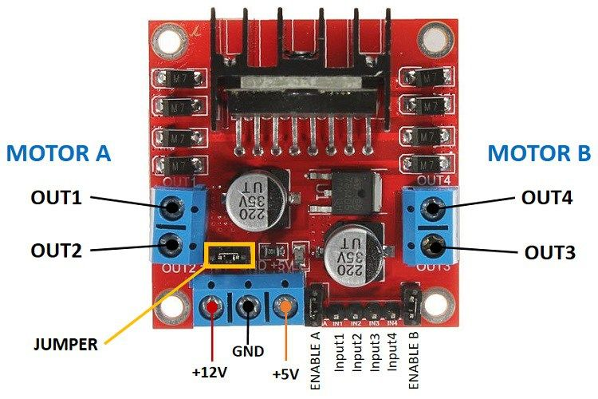

# Tutorial 3 - Motor Driver 

Continuing on from the last tutorial, next we will explore the "act" portion of the robotics loop. The act operation involves sending information to physical hardware that moves the robot. As you can imagine, when the robot moves, all of its sensor information will change which triggers the loop again.

<p align="center">
    
</p>

In the rest of this of this tutorial we will learn about motor drivers as well as how to use them together with a micro-controller, such as an Arduino, to control DC motors. 

<p align="center">
    
</p>

## H-Bridge 

A H-Bridge is a circuit which can be used to control the direction of a DC motor. It contains four switching elements (usually transistors) which together with a motor form a H-like configuration. The switching elements form "complementary" pairs which allows the direction of current flow to the motor to be reversed if desired. In other words, the H-Bridge acts as a set of digitally controlled switches which can be used to control the voltage across a motor. 

<p align="center">
    
</p> 

The L298N is a dual H-Bridge motor driver which allows both the speed and direction of two DC-motors to be controlled at the same time. But wait a minute, speed? (don't worry we'll get onto this later)

Shown below is a layout of the L298N along with pin and terminal defintions. 

<p align="center">
    
</p> 

Name | Function |
--- | ---------- |
Vcc  |  This voltage is used to either only power the motors or both the motors as well as all the logic circuitry on the board. This depends on whether the "jumper" is left on in which case only Vcc needs to be supplied. 
+5V | When the jumper is connected, this terminal acts as an optional 5V output. Oppositely, when the jumper is disconnected, this acts as a 5V input which will be required to drive the logic circuity on the board. 
GND| Common ground for all power supplies. 
Out 1/2/3/4 | These is where you will connect your motors. 
Enable A/B | These are 5V input pins which turn on the motors. Enable A corresponds to motor A and Enable B corresponds to motor B. 
Input 1/2/3/4 | These are the switches that can be digitally controlled via the Arduino to control the direction of the motors. Input 1 and 2 correspond to motor A and Input 3 and 4 correspond to motor B. 
Jumper | If more than 12V is provided, the jumper should always be removed as the onboard 5V regulator could be damaged. In this case, you will need to provide the 5V input separately to power the onboard logic circuitry. 

## Task 1: Controlling the direction of motors 

Components needed:

- L298N H-Bridge 
- 3V DC Motor 
- 2 x Banana Leads
- Arduino UNO with USB cable
- DC Power Supply
- Screwdriver set
- Jumper wires

NOTE: for simplicity, this tutorial only investigates using one motor with the H-Bridge, but this can be repeated for two  motors.

To provide some motivation for this section, questions you must be asking yourself are "why can't we just directly connect our motors to the Arduino and whats the point of using the H-Bridge?". Simply put, the pins on the Arduino board just won't be able to supply enough current to drive the motors directly ([more info here](https://electronics.stackexchange.com/questions/57238/why-exactly-does-connecting-a-motor-directly-to-an-arduino-damage-it )). Because the H-Bridge also only requires simple digital logic (on-off) in order to both turn on and control the direction of DC motors, this is another advantage of using an Arduino as it can easily  provide these inputs  signals!

#### Wiring up

1) Connect the DC motor to the OUT 1 and OUT 2 terminals on the H-Bridge (you will need to use a screwdriver for screw terminal connections)

2) Ensure that the jumper connector (see image above) is disconnected. We will be using a DC power supply to power the motors separately and the Arduino to power the logic circuitry on the H-Bridge. 

3) Because we are using 3V motors, we need to be supplying at least 4.4V to the Vcc terminal on the H-Bridge. Before turning on the DC
power supply, make sure that the setting on the top-right of the DC Power supply is set to "Normal"
and nothing is connected.


<p align="center">
    
</p> 

- To be able to supply enough voltage to the motor using the H-Bridge, we need to ensure we are supplying at least 1.4V higher than the voltage rating for the motor. The voltage drop of the input is a result of the switching transistors in the circuit.

4) Connect the banana leads to one of the display sides + and - terminals. Adjust the output voltage to 4.4V. Attach the wires from the DC power supply to the Vcc and GND input screw terminals.

<p align="center">
    
</p> 

5) Shown below is the pin connections between the Arduino and the H-Bridge. You will need male-to-male jumper wires for the first two pin connections and male-to-female jumper wires for the others. 

Arduino | L298N 
--- | --------
5V | +5V 
GND | GND 
Pin 9 | ENA  
Pin 10 | IN1  
Pin 11 | IN2  

### Code - Motor Direction

Plug in your Arduino to your computer. At this point a red LED on the H-Bridge should light up. 

Use the following sample code below to test your motors. Remember to turn on your DC supply so that the motors are powered. 

```C++
// Pin layout
int ENA = 9;
int IN1 = 10;
int IN2 = 11;

// Pin definitions
void setup() {

pinMode(IN1, OUTPUT); 
pinMode(IN2, OUTPUT);
pinMode(ENA_PWM, OUTPUT);

}

// Sending signals to H-Bridge Pins
void loop() {
digitalWrite(ENA, HIGH); //Enables the motor
digitalWrite(IN1, HIGH); //Turns the motor one way
digitalWrite(IN2, LOW);
}
```
1) Note down the direction the motor is turning. Can you modify the code to make the motor turn  the other way? Use the table below to help you. See if you can identify the function of each of the variations! (e.g turn motor clockwise, turn off motor etc.)

EN |IN1 | IN2 | Function
-- | --- | --- | --- 
H | H  | H | ?
H | H | L | ?
H | L | H | ?
H | L | L | ?
L | X | X | ?

2) Make the motor turn in one direction for half a second and then turn the other way for another half a second. 

Now that you understand how to control the direction of a motor using a H-Bridge, next lets see how we can control its speed. 

## Task 2: Controlling the speed of motors 

### Pulse Width Modulation

Pulse width modulation or PWM is a technique that is used to vary the effective voltage supplied to a load. This is achieved by varying the duty cycle of the input voltage, which is percentage of time the voltage level is high within one period. 

<p align="center">
    
</p>

For example, imagine we are powering a DC motor with a power source. With the power source on, at first the motor will start to speed up. However, because motors do not respond immediately, it will take some time to reach full speed. Before the motor reaches full speed, if we disconnect power, the motor will start to slow down. If we keep switching the power source on and off quickly enough, the motor will run at some speed between 0 and full speed. This describes exactly what a PWM controller does. It switches the motor on in a series of pulses and controls the motor's speed by varying (modulating) the width of the pulses.  

From the last tutorial, we showed that the [analogWrite](https://www.arduino.cc/reference/en/language/functions/analog-io/analogwrite/) function can be used to generate a PWM signal on pins 3,5,6,9,10 and 11 on most Arduino boards.

### Code - Motor Speed

1) Using the sample code above, modify it so that you can control the speed of the motor. (HINT: use analogWrite)

2) Make motor slowly speed up and slow down. 

3) Answer this question: Assuming you had two motors running, how would you rotate the robot to face a different direction?

## Conclusion

In the last tutorial, you learnt about the "sense" operation of the robotics loop which relates to how robots percieve dynamic changes in their environment. In this tutorial you've learnt about the "act" operation, which relates to the physical signals that are sent to the robot which allows it to move. We have however not explicitly explored the last operation, "planning", which involves the decision making logic the robot will use once it understands its environment. Other than building a functioning robot, this will be other main focus of the competition.

Congratulations on finishing the tutorials for RBC! The competition ahead will require strong teamwork
and the skills you have developed over the weeks. Organisers and Volunteers are available to help you
along the way but smart thinking and problem solving will get you ahead. Good luck!