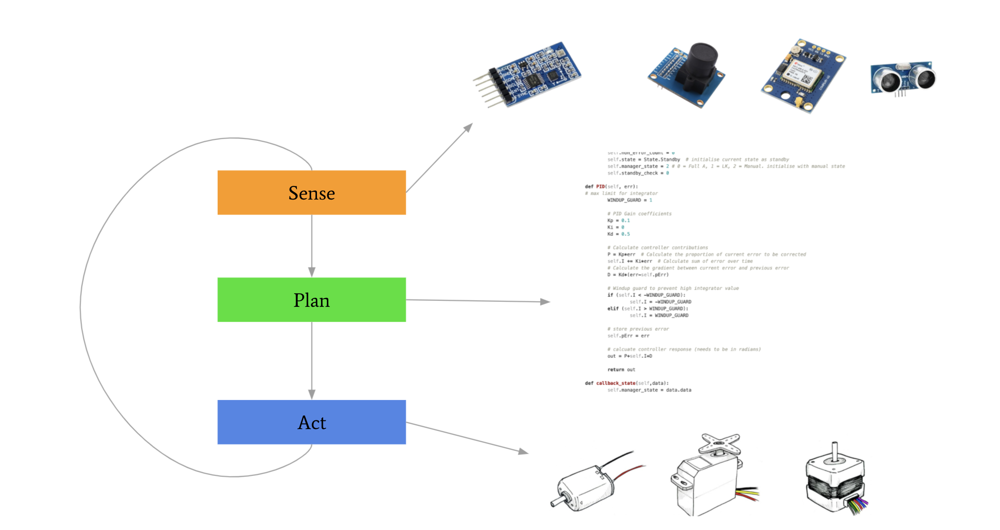
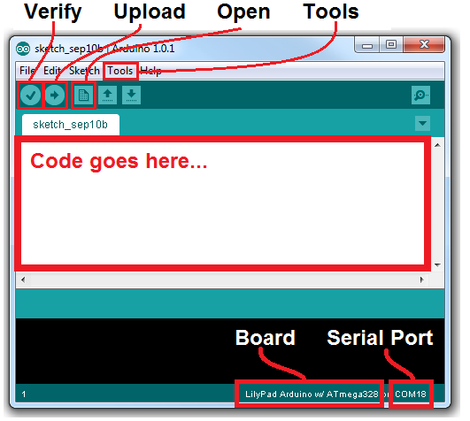
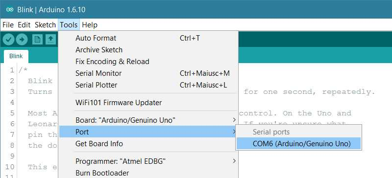
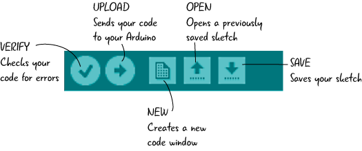
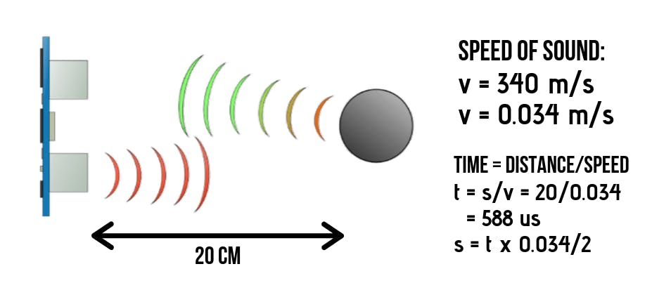
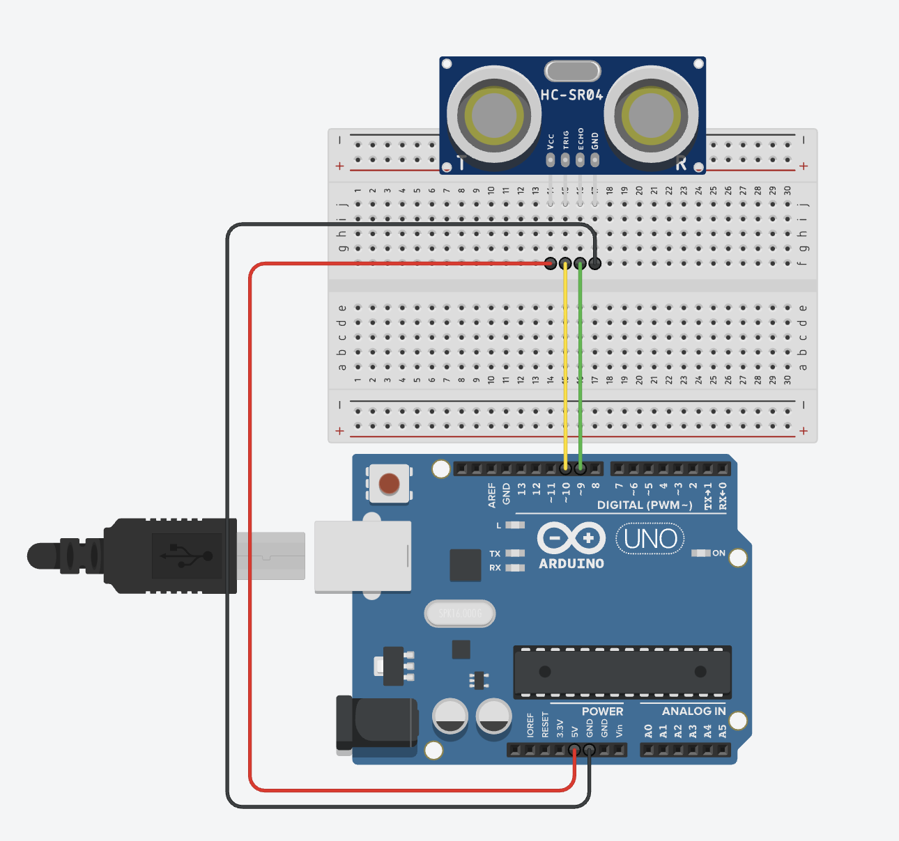
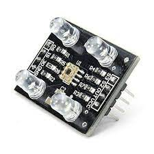
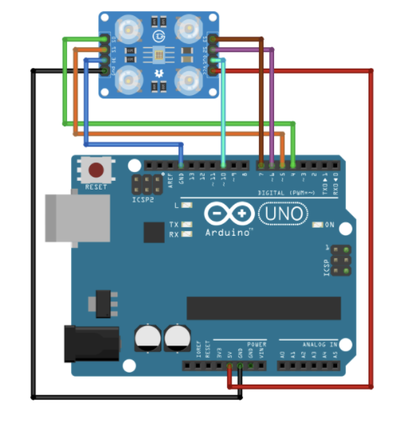
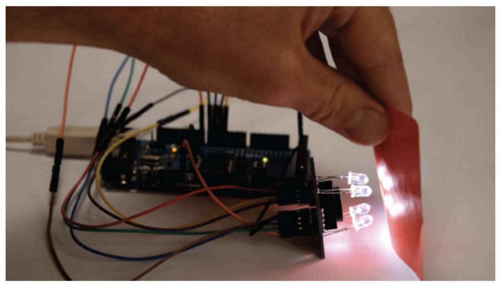

# Tutorial 2 - Arduino & Sensors

In this tutorial we will learn how to use sensors along with an Arduino to percieve the environment. We will start by setting up your programming environment and end with a mini-project to better understand sensor fusion.

# Table of Contents
1. [Introduction](#Introduction)

2. [Set up your Arduino environment](#Set-up-your-Arduino-environment)
    
    2.1. [Arduino theory](#Arduino-theory)

3. [Ultrasonic Sensor](#Ultrasonic-Sensor)

4. [Colour Sensor](#Colour-Sensor)
    
    4.1. [Procesing values](#Procesing-values)
    
    4.2. [Calibration](#Calibration)

5. [Workshop Challenge](#Workshop-Challenge)


# Introduction

The fundamental robotics loop consists of three sections: sensing the environment, planning, and taking an action. This tutorial will focus on the first part of the loop. 

<p align="center">
    
</p>

As we will be dealing with an ultrasonic and a colour sensor, only these sensors will be explored. To process the raw signals provided by the sensors into meaningful data, we will use the Arduino Uno microcontroller.

#### Materials required

- 1 x Arduino Uno with USB cable
- 1 x TCS230 TCS3200 Colour Sensor
- 1 x HC-SR04 Ultrasonics Sensor
- 1 x Breadboard
- Variety of jumper cables

# Set up your Arduino environment
Skip this step if you already have the Arduino IDE installed. If you don't have the IDE:

- Go to https://www.arduino.cc/en/software
- Select the IDE suitable for your operating system.
- Download and install the IDE.

<p align="center">
    
</p>

Once downloaded, copy the following code and paste it in the ```code goes here``` section.

```C++
void setup() {
  Serial.begin(9600);

  // initialize digital pin LED_BUILTIN as an output.
  pinMode(LED_BUILTIN, OUTPUT);
}

// the loop function runs over and over again forever
void loop() {
  digitalWrite(LED_BUILTIN, HIGH);   // turn the LED on 
  Serial.println("LED is ON!")
  delay(500);                        // wait for half a second

  digitalWrite(LED_BUILTIN, LOW);    // turn the LED off 
  Serial.println("LED is OFF!")
  delay(500);                        // wait for half a second
}
```

<p align="center">
    
</p>

Upload and run the arduino script and check if everything works! The LED on the Arduino should turn on and off.

<p align="center">
    
</p>

**NOTE: Make sure you have the right COM port, baud rate, and board selected. If you have any problems setting the environment up, ask a demonstrator.**

## Arduino theory
Reading the code you used earlier, did you figure out the basics arduino I/O (Input/Output) code? 

If you need an Arduino intro, this section explains the Arduino and it's code in detail. Skip this part if you understand the basics.

An Arduino Uno has 14 digital I/O (input, output) pins and 6 analogue input pins. Digital pins (0-13) can be in 2 states, either HIGH (5V) or LOW (0V) and are usually used to drive outputs. Analogue pins (A0-A5) can be used for analogue signals, such as colour and light sensors. Notice that some of the pins are marked (PWM ∼), pins 3, 5, 6, 9, 10, and 11. These pins allow you to use Pulse Width Modulation (PWM ∼), which will be discussed in the next tutorial. This feature allows you to control the speed of your motors or the brightness of an LED.

Each pin type, whether it’s digital or analogue, has a different method associated with it to either read a signal going into it or write a signal as its output. In summary, these functions are:

- **int digitalRead(int pin)**: Reads a value from a digital pin. The value returned is either the constant HIGH or LOW.

- **void digitalWrite(int pin, int value)**: Writes a value from a digital value (i.e. either HIGH or LOW) to the specified pin.

- **int analogRead(int pin)**: Reads an analogue voltage between 0 V and 5 V from an analogue pin (A0 to A5). The value returned is an integer between 0 and 1023, directly proportional to the voltage read - these values can vary alot at different times.

- **void analogWrite(int pin, int value)**: Writes an analogue value between 0 and 255 to one of the PWM-enabled pins. This corresponds to the duty cycle of the PWM wave, 0 being always off and 255 being always on. Note that this is not the same range of values as an analogue read.

Additionally, the Arduino can communicate with your computer over the USB cable using what is called Serial Communication. The two main functions for this are:

- **Serial.begin(int baud_rate)**: Sets the data rate in bits per second (baud) for serial data transmission. For communicating with Serial Monitor, make sure to use one of the baud rates listed in the menu at the bottom right corner of its screen. 

- **Serial.println(val)**: Prints data to the serial port as human-readable ASCII text followed by a carriage return character (ASCII 13, or '\r') and a newline character (ASCII 10, or '\n'). 

When you first begin a new project in Arduino, you are typically greeted with two functions that have been created for you, **setup()** and **loop()**. These are special functions that are required to make your Arduino program run.

The **setup()** block only runs once when the board is powered on. So any code that is placed inside the setup() block will be executed exactly once. For this reason, the setup() method is generally used to set up your program, for example to define pin mode (discussed below) or write any initial values to these pins.

The **loop()** block is executed repeatedly for the duration of program after the setup() block has finished. It is essentially an infinite loop and stops running only if you power down the device. This method is where the bulk of your program goes, from reading sensors to controlling motors. It is good practice to break down the different aspects of your code into individual functions and call those in loop(). This will make your code much cleaner and more modular, making it easier to debug.

# Ultrasonic Sensor

<p align="center">
    
</p>

#### Pins to remember

Vcc: 5V to power the sensor

Trig: Signals the sensor to send a pulse

Echo: Output the time in microseconds

Gnd: Ground

## How it works
The transmitter of the ultrasonic sensor emits a signal at 40,000 Hz in the form of an 8 cycle sonic burst. This signal travels through air at the speed of sound. Therefore, considering the travel time and the speed of the sound you can calculate the distance!

<p align="center">
    
</p>


## How to use it
We will be using the Arduino Uno as our microcontroller for this competition, therefore this tutorial will be using Arduino code.

### Step 1. Wiring the sensor up

Pin | on arduino |
--- | ---------- |
Vcc |  5V        |
Trig|  Pin 10    |
Echo|  Pin 9     |
Gnd |  Gnd       |

Here is a schematic for reference. You don't need to strictly follow this.

<p align="center">
    
</p>


### Step 2. The code
To create the 8 signal burst, talked about previously, we have to set the Trig on a High State for 10 µs. Once the transmitted signal is recieved, the Echo pin will output the time in microseconds the sound wave took to travel back.

Create a new arduino code window and initialise the pins using:
```C++
// defines pins numbers
const int trigPin = 9;
const int echoPin = 10;

// defines variables
long duration;
int distance;
```

Remember that the Arduino requires two functions for the script to work, a ```void setup()``` and a ```void loop()```. The setup functions runs once when the code is uploaded, while the loop function runs infinitely until the arduino looses power.

Create the setup function to set pin modes and establish serial comminucation with the serial moitor.

```C++
void setup() {
    pinMode(trigPin, OUTPUT); // Sets the trigPin as an Output
    pinMode(echoPin, INPUT); // Sets the echoPin as an Input
    Serial.begin(9600); // Starts the serial communication
}
```

If you would like to know more about the basics look up https://www.arduino.cc/en/Guide.

Now to continuously calculate (infinitely) the distance to an object we have to do the following within a loop funtion:

- Clear the trigger pin (set it to ground)
- Set the trigger pin high for 10us
- Read the Echo pin for the duration
- calculate the distance
- Print the distance to the serial monitor.

Let's start by creating a ```void loop()``` function and clear the trigger pin to make sure its set to low.
```C++
void loop()
{
    // Clears the trigPin
    digitalWrite(trigPin, LOW);
    delayMicroseconds(2);
}
```

Now, to send the ultrasonic pulse lets set the trigger pin to high and then reset it.
```C++
void loop()
{
    // Clears the trigPin
    digitalWrite(trigPin, LOW);
    delayMicroseconds(2);

    // Sets the trigPin on HIGH state for 10 micro seconds
    digitalWrite(trigPin, HIGH);
    delayMicroseconds(10);
    digitalWrite(trigPin, LOW);
}
```

All we have to do now is read the echo pin and display the result on the serial monitor.
```C++
void loop()
{
    // Clears the trigPin
    digitalWrite(trigPin, LOW);
    delayMicroseconds(2);

    // Sets the trigPin on HIGH state for 10 micro seconds
    digitalWrite(trigPin, HIGH);
    delayMicroseconds(10);
    digitalWrite(trigPin, LOW);

    // Reads the echoPin, returns the sound wave travel time in microseconds
    duration = pulseIn(echoPin, HIGH);

    // Prints the duration on the Serial Monitor
    Serial.print("Duration: ");
    Serial.println(duration);
}
```

But what you will get from the Echo pin will be double that number because the sound wave needs to travel forward and bounce backward.  So in order to get the distance in cm we need to multiply the received travel time value from the echo pin by 0.034 cm/us (speed of souund) and divide it by 2.

```C++
void loop()
{
    // Clears the trigPin
    digitalWrite(trigPin, LOW);
    delayMicroseconds(2);

    // Sets the trigPin on HIGH state for 10 micro seconds
    digitalWrite(trigPin, HIGH);
    delayMicroseconds(10);
    digitalWrite(trigPin, LOW);

    // Reads the echoPin, returns the sound wave travel time in microseconds
    duration = pulseIn(echoPin, HIGH);

    // Calculating the distance
    distance= duration*0.034/2;

    // Prints the distance on the Serial Monitor
    Serial.print("Distance: ");
    Serial.println(distance);
}
```

**All you have to do is upload your code and off you go calculating distances!**

#### Final Code
```C++
// defines pins numbers
const int trigPin = 9;
const int echoPin = 10;

// defines variables
long duration;
int distance;

void setup() {
    pinMode(trigPin, OUTPUT); // Sets the trigPin as an Output
    pinMode(echoPin, INPUT); // Sets the echoPin as an Input
    Serial.begin(9600); // Starts the serial communication
}

void loop()
{
    // Clears the trigPin
    digitalWrite(trigPin, LOW);
    delayMicroseconds(2);

    // Sets the trigPin on HIGH state for 10 micro seconds
    digitalWrite(trigPin, HIGH);
    delayMicroseconds(10);
    digitalWrite(trigPin, LOW);

    // Reads the echoPin, returns the sound wave travel time in microseconds
    duration = pulseIn(echoPin, HIGH);

    // Calculating the distance
    distance= duration*0.034/2;

    // Prints the distance on the Serial Monitor
    Serial.print("Distance: ");
    Serial.println(distance);
}
```

### Using the NewPing library

To make your code a lot cleaner, you could also use the NewPing library or code up a more object oriented program yourself.

For more details check out https://playground.arduino.cc/Code/NewPing/.

#### Implementation
```C++
#include <NewPing.h>
 
#define TRIGGER_PIN  12
#define ECHO_PIN     11
#define MAX_DISTANCE 200
 
NewPing sonar(TRIGGER_PIN, ECHO_PIN, MAX_DISTANCE);
 
void setup() {
  Serial.begin(115200);
}
 
void loop() {
  delay(50);
  Serial.print("Ping: ");
  Serial.print(sonar.ping_cm());
  Serial.println("cm");
}
```
 ---

# Colour Sensor

<p align="center">
    
</p>

## How to use it

### Step 1. Wiring the sensor up

Pin | on arduino | Description |
--- | ---------- | ----------- |
Vcc |  5V        | Input power, required to provide power to sensor. |
Gnd |  Gnd       | Ground pin, used as refrence voltage |
OC  |  Gnd       | Output enable, need to be pulled low in order to enable the sensor |
OUT |  Pin 8    | Output of the sensor, a PWM signal (variable frequency) depending of which colour is sensed |
S0  | Pin 4      | Used to scale output frequency - keep reading for an expression |
S1  | Pin 5      | Used to scale output frequency |
S2  | Pin 6      | Used to select which filter we apply. These two pin logic control which colour sensor light intensity is to be measured |
S3  | Pin 7      | Used to select which filter we apply |

The sensor consists of 4 LEDs as a light source and an 8x8 array of photodiodes, with different colour filters attached to them (red, green, blue or clear). 

From the table below, it can be seen that by using control pins S2 and S3 we can choose which photodiodes to read from. For example, if I want to read from the red photodiode, I would set S2 and S3 LOW (0V on those pins).

S2  |  S3 | Photodiode Type   |
--- | --- | ----------------- |
L   |  L  | Red               |
L   |  H  | Blue              |
H   |  L  | Clear (no filter) |
H   |  H  | Green             |

Now, on the hardware side, we can connect our sensor into the Arduino. The following diagram provides a guide of how the sensor should be connected up:

<p align="center">
    
</p>


### Step 2. The code

To be able to print frequency values to the serial monitor we first start by defining the sensor pins and global variables.

```C++
#define S0 4
#define S1 5
#define S2 6
#define S3 7
#define sensorOut 8

int frequency = 0;
```

We can now create the required **setup()** funtion that initializes the pins defined previously to inputs and outputs and start the serial monitor.

To learn more about frequency scaling of the sensor check out: https://howtomechatronics.com/tutorials/arduino/arduino-color-sensing-tutorial-tcs230-tcs3200-color-sensor/
```C++
void setup() {
  pinMode(S0, OUTPUT);
  pinMode(S1, OUTPUT);
  pinMode(S2, OUTPUT);
  pinMode(S3, OUTPUT);
  pinMode(sensorOut, INPUT);
  
  // Setting frequency-scaling to 20%
  digitalWrite(S0,HIGH);
  digitalWrite(S1,LOW);
  
  Serial.begin(9600);
}
```

We can now set S2 and S3 to select the photodiodes to read from. By succesively cycling through each photodiode type and using [PulseIn()](https://www.arduino.cc/reference/en/language/functions/advanced-io/pulsein/) we can read the output frequency.

See the photodiode type table above for more detail.

```C++
void loop() {
  // Setting red filtered photodiodes to be read
  digitalWrite(S2,LOW);
  digitalWrite(S3,LOW);

  // Reading the output frequency
  frequency = pulseIn(sensorOut, LOW);

  // Printing the value on the serial monitor
  Serial.print("R= ");         //printing name
  Serial.print(frequency);     //printing RED color frequency
  Serial.print("  ");
  delay(100);

  // Setting Green filtered photodiodes to be read
  digitalWrite(S2,HIGH);
  digitalWrite(S3,HIGH);

  // Reading the output frequency
  frequency = pulseIn(sensorOut, LOW);

  // Printing the value on the serial monitor
  Serial.print("G= ");          //printing name
  Serial.print(frequency);      //printing GREEN color frequency
  Serial.print("  ");
  delay(100);

  // Setting Blue filtered photodiodes to be read
  digitalWrite(S2,LOW);
  digitalWrite(S3,HIGH);

  // Reading the output frequency
  frequency = pulseIn(sensorOut, LOW);

  // Printing the value on the serial monitor
  Serial.print("B= ");          //printing name
  Serial.print(frequency);      //printing RED color frequency
  Serial.println("  ");
  delay(100);
}
```

#### Processing values
We now have to think about turning the values we receive from the colour sensor into information that we understand and that we can use to make decisions for our robot. This means converting the frequencies into RGB values which we can use to figure out which colour it is. 

To do this, we must first calibrate our sensor. Point the sensor into a direction where there is nothing in front of it and note down the values being printed.

<p align="center">
    
</p>

After noting down those values, we now put a colour in front of the sensor. According to the datasheet, the best sensing range is at 10mm, too close or too far will compromise the accuracy of the sensor. It is up to you to choose a distance that suits your build, but just make sure it’s consistent, or else the sensor will not
work properly. 

So putting the colour red in front of the sensor at the distance of your choice will produce different red frequency values. Note that value down as well.

#### Calibration
You can begin noting the sensor outputs for each particular colour that you’ll encounter during the competition and realise that each colour has it’s own unique RGB signature. Let’s say that for a shade of red we witness low frequency readings of the red and green photodiodes. We could then develop code that perhaps looks for the lowest frequency between the RGB outputs, or perhaps see if the outputs fall within a certain range of values unique to that shade of red. This is the simplest form of software you could develop for the
competition and still see accurate results - but we can do better.

The range of outputs that you get for each colour is different, but it'd be nice if they were all in the same range so we could compare them more easily. A good way of doing this is using the **map()** function.

```C++

map(value, old min, old max, new min, new max)

```

For example, let’s say we get a value of 70 with nothing in front of the sensor, and a value of 25 with a red filter, we would type the following line into the appropriate section (after reading in the frequency value):

```C++

int new_frequency = map(frequency, 25, 70, 0, 255)

```

When the sensor outputs 25, new_frequency will be 0. When it outputs 70, new_frequency will be 255. And in-between values will be in-between 0 and 255.

Do the same with green and blue. This will then produce an appropriate RGB value, we can then go online to any RGB value website (there’s one suggested in the references) and select the values that you need for the competition. Make sure you test the accuracy of your calibration with various colours to determine how well it works. If it doesn’t work well, you might need to redo your calibration.

