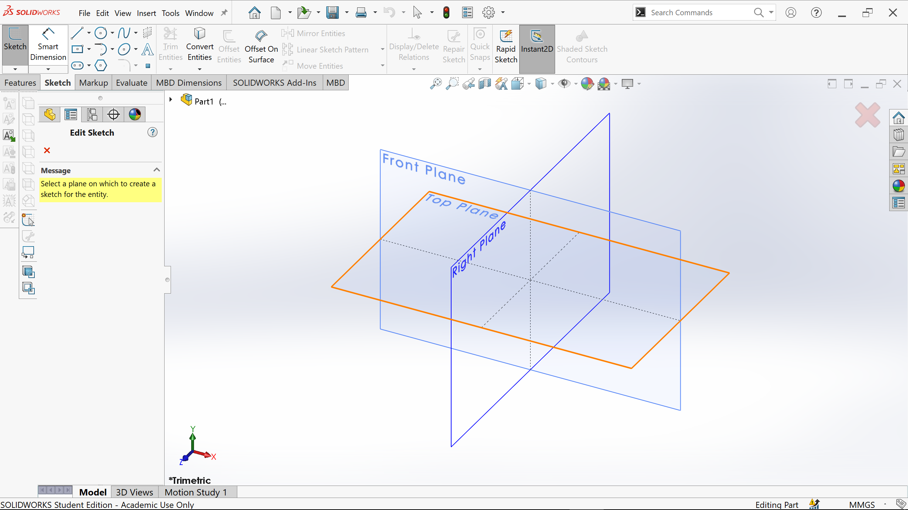
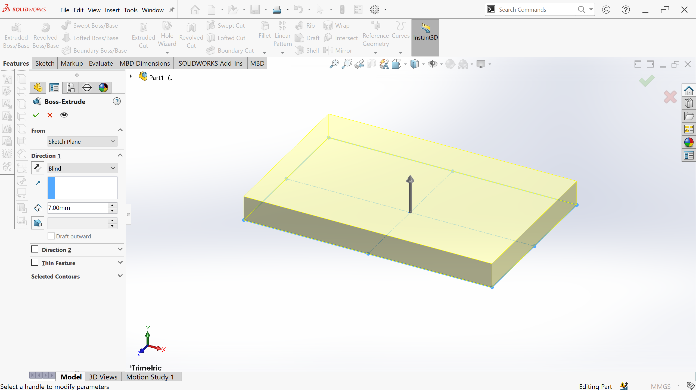
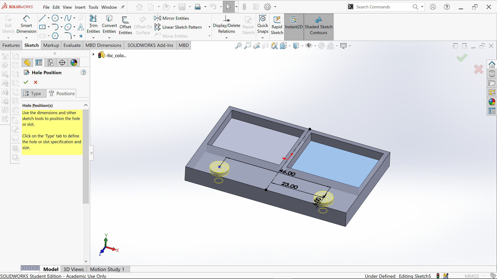
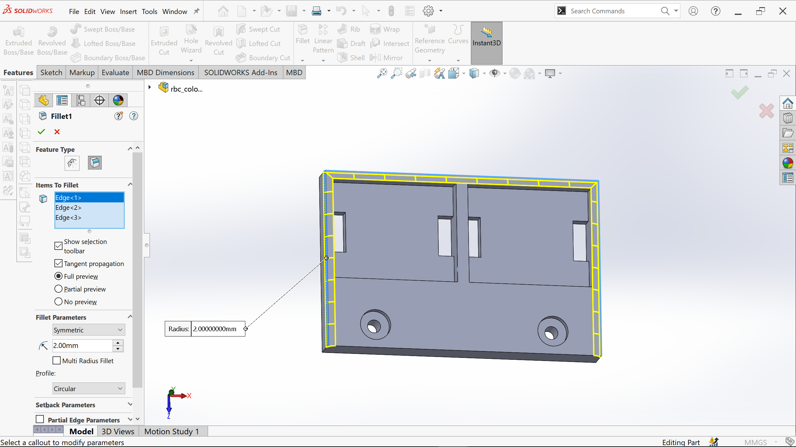

# Tutorial 1 - CAD (3D Modelling)

	
			    

## Introduction
In this tutorial, you will be introduced to Solidworks, a CAD program used to create 3D models.
We will show you how to create a mount (see above left) for the colour sensors that you can use on your robot. We will 3D print one design per team.

## Installation/Setup

You can install SolidWorks Student Edition from https://www.monash.edu/esolutions/software/catalogue if you have Windows, otherwise you can use MoVE (move.monash.edu) to use SolidWorks.

## Creating the mount

**1. Open SolidWorks**

**2. Click Part to create a new part**

You'll be greeted with an empty working area. There are 3 main parts to the interface: 
- Features toolbar - this contains operations to perform and features to add to your part
- Property manager - shows a list of features that have been added, in chronological order
- Perspective bar - can be used to change your view of the part.

**3. Sketch the outline of the part**

- Click on the Sketch tab and then the Sketch button to create a new sketch.

- Click on the Top Plane to make sure the sketch will be the right way up.

- Click on the Center Rectangle tool.

- Hover over the origin so that an orange circle appears and click to start drawing the rectangle.

- Drag and click to finish drawing the rectangle.

- Click the Smart Dimension tool.
- Dimension the rectangle to be 71x46mm: Click on an edge with the Smart Dimension tool then click again and type the dimension.
- When the rectangle is fully dimensioned, its edges should turn black.

- Click Exit Sketch in the top left.

**4. Extrude the part**

This step takes the 2D sketch and creates a 3D part by stretching it.
- Make sure the sketch is selected (the edges should look blue). You can select it in the Property Manager.
- In the Feature tab, click Extruded Boss/Base.

- Ensure the direction is set to Blind
- Set the depth to 7mm

- Click the green tick to finish the extrusion.

**5. Create a recessed section for the sensors**

- Select the top face of the part
- In the Features tab, click on Extruded Cut

- Create a rectangle near the top-left corner
- Dimension it using the Smart Dimension tool to be 26mm x 32mm
- Position it 2mm from the top and left edges:
	- Using the Smart Dimension tool, click the top edge of the new rectangle, then the top edge of the overall part, and set this to 2mm.
	- Do the same for the left edge

- Mirror the rectangle
	- Create a line to be used for mirroring
		- Choose the centreline tool
		
		- Hover near the midpoint of the top line until it appears and is orange, click it.
		
		- Drag the mouse down, making sure that the line snaps to be vertical, before clicking to finish the line.
		
	- Select the four edges of the rectangle by Ctrl-clicking each edge (or just click in the empty space inside the rectangle)
	
	- Click Mirror Entities in the Sketch tab.
	- Click into the Mirror About box
	
	- Click the centreline that you just created
	
	- Click the green tick to finish Mirroring

- Click Exit Sketch and set the cutting depth to 4mm. 
- Click the green tick to finish the cut.

**6. Add holes for screws**
We will use the Hole Wizard tool to create standard size screw holes. We could use our own sketch to create holes for screws, and dimension them ourselves...but
it’s just much cooler (and perhaps easier, faster, and simpler) this way.

- Make sure the top face is selected. (The one with the cuts)
- In the Features tab, click on the Hole Wizard tool.
- Choose Standard: AS, Type: Mushroom Head Screw.
- Make sure Hole Type is Counterbore
- Size: M3, Fit: Normal

- Click onto the Positions tab in the Property Manager.
- Click on the part to place two holes near the bottom.
- Create a centreline and dimension the holes as below

**7. Add slots for the wiring**

- Use the Extruded Cut tool
- Sketch the cutouts
	- Draw a rectangle flush with the edge on the left and dimension it as apprpriate (4mm x 10.5mm).
	- Create a centreline in the middle of the cavity, and another in the middle of the part.
	
	- Mirror the rectangle about the small centreline, then mirror the two rectangles about the larger centreline.
	
- Exit the Sketch
- Change the cut direction from Blind to Through All so that it will cut through the entire part

- Click the green tick to finish the cut.
- Check that the model looks like below:

**8. Fillet the edges**

We will now use the Fillet tool to create smooth, curved corners.

- In the Features tab, click on the Fillet tool.
- Set the fillet radius to 2mm and click on the three edges as shown.

- Click the green tick to finish filleting.

Once you have completed this step, your part is done and you can get a demonstrator to check over your model. 

**9. Optional: Add text**

You can use an Extruded Cut to add some text with your team name to the top of your model if you wish. Try to stick to simple text or it is likely to become illegible when printed.

## Submission Details

Please upload your Solidworks part to the [Google Drive folder]() by ***. Make sure that the file name includes your team name if you have one, or your own name if you do not. Late submissions cannot be accepted as it will take time to 3D print the models: we will supply your team with a standard part in this case.

## Looking for more CAD?

SolidWorks has in-built tutorials that cover all many features step-by-step in a nice order. You can run them by clicking on the Help/question mark icon on the right of the menu bar.
