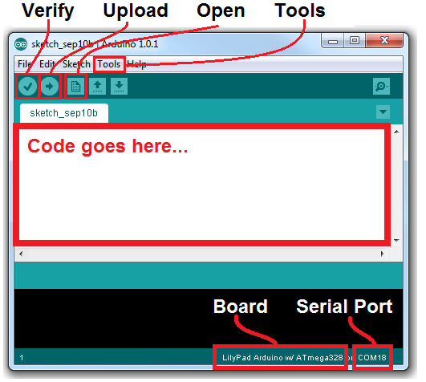
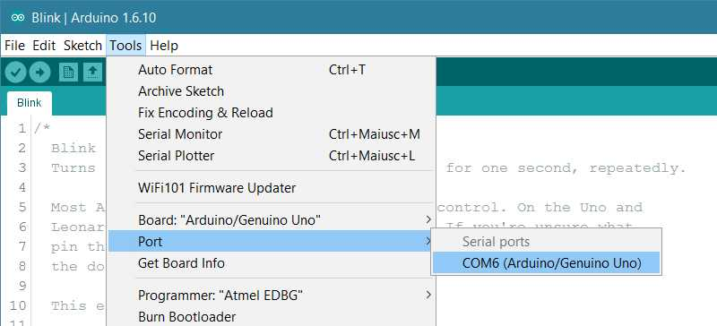

# RBC ultrasonic sensor turorial

In this tutorial we will learn how to use the ultrasonic sensor provided with the arduino to get accurate distance measurements.

# Table of Contents
1. [How it works](#How-it-works)
2. [How to use it](#How-to-use-it)
3. [Final Code](#Final-Code)

<p align="center">
    
</p>

#### Pins to remember
Vcc: 5V to power the sensor

Trig: Signals the sensor to send a pulse

Echo: Output the time in microseconds

Gnd: Ground

## How it works
The transmitter of the ultrasonic sensor emits a signal at 40,000 Hz in the form of an 8 cycle sonic burst. This signal travels through air at the speed of sound. Therefore, considering the travel time and the speed of the sound you can calculate the distance!

<p align="center">
    
</p>


## How to use it
We will be using the Arduino Uno as our microcontroller for this competition, therefore this tutorial will be using Arduino code.

### Step 1. Wiring the sensor up

Pin | on arduino |
--- | ---------- |
Vcc |  5V        |
Trig|  Pin 10    |
Echo|  Pin 9     |
Gnd |  Gnd       |

Here is a schematic for reference.

<p align="center">
    
</p>

### Step 2. Set up your environment
Skip this step if you aldready have the arduino IDE installed. If you dont have the IDE:

- Go to https://www.arduino.cc/en/software
- Select the IDE suitable to your operating system.
- Download and install the IDE.

<p align="center">
    
</p>

Once downloaded, copy the following code and paste it in the ```code goes here``` section.

```arduino
void setup() {
  // initialize digital pin LED_BUILTIN as an output.
  pinMode(LED_BUILTIN, OUTPUT);
}

// the loop function runs over and over again forever
void loop() {
  digitalWrite(LED_BUILTIN, HIGH);   // turn the LED on 
  delay(500);                       // wait for half a second
  digitalWrite(LED_BUILTIN, LOW);    // turn the LED off 
  delay(500);                       // wait for half a second
}
```

Make sure you have the right port and board selected.

<p align="center">
    
</p>

Upload and run the arduino script and check if everything works!

<p align="center">
    
</p>

**If you have any problems setting the environmemnt up, ask a demonstrator.**

### Step 2. The code
To create the 8 signal burst, talked about previously, we have to set the Trig on a High State for 10 µs. Once the transmitted signal is recieved, the Echo pin will output the time in microseconds the sound wave took to travel back.

Create a new arduino code window and initialise the pins using:
```C++
// defines pins numbers
const int trigPin = 9;
const int echoPin = 10;

// defines variables
long duration;
int distance;
```

Arduino requires two functions for the script to work, a ```void setup()``` and a ```void loop()```. The setup functions runs once when the code is uploaded, while the loop function runs infinitely until the arduino looses power.

Create the setup function to set pin modes and establish serial comminucation with the serial moitor.

```C++
void setup() {
    pinMode(trigPin, OUTPUT); // Sets the trigPin as an Output
    pinMode(echoPin, INPUT); // Sets the echoPin as an Input
    Serial.begin(9600); // Starts the serial communication
}
```

If you would like to know more about the basics look up https://www.arduino.cc/en/Guide.

Now to continuously calculate (infinitely) the distance to an object we have to do the following within a loop funtion:

- Clear the trigger pin (set it to ground)
- Set the trigger pin high for 10us
- Read the Echo pin for the duration
- calculate the distance
- Print the distance to the serial monitor.

Let's start by creating a ```void loop()``` function and clear the trigger pin to make sure its set to low.
```C++
void loop()
{
    // Clears the trigPin
    digitalWrite(trigPin, LOW);
    delayMicroseconds(2);
}
```

Now, to send the ultrasonic pulse lets set the trigger pin to high and then reset it.
```C++
void loop()
{
    // Clears the trigPin
    digitalWrite(trigPin, LOW);
    delayMicroseconds(2);

    // Sets the trigPin on HIGH state for 10 micro seconds
    digitalWrite(trigPin, HIGH);
    delayMicroseconds(10);
    digitalWrite(trigPin, LOW);
}
```

All we have to do now is read the echo pin and display the result on the serial monitor.
```C++
void loop()
{
    // Clears the trigPin
    digitalWrite(trigPin, LOW);
    delayMicroseconds(2);

    // Sets the trigPin on HIGH state for 10 micro seconds
    digitalWrite(trigPin, HIGH);
    delayMicroseconds(10);
    digitalWrite(trigPin, LOW);

    // Reads the echoPin, returns the sound wave travel time in microseconds
    duration = pulseIn(echoPin, HIGH);

    // Prints the duration on the Serial Monitor
    Serial.print("Duration: ");
    Serial.println(distance);
}
```

But what you will get from the Echo pin will be double that number because the sound wave needs to travel forward and bounce backward.  So in order to get the distance in cm we need to multiply the received travel time value from the echo pin by 0.034 cm/us (speed of souund) and divide it by 2.

```C++
void loop()
{
    // Clears the trigPin
    digitalWrite(trigPin, LOW);
    delayMicroseconds(2);

    // Sets the trigPin on HIGH state for 10 micro seconds
    digitalWrite(trigPin, HIGH);
    delayMicroseconds(10);
    digitalWrite(trigPin, LOW);

    // Reads the echoPin, returns the sound wave travel time in microseconds
    duration = pulseIn(echoPin, HIGH);

    // Calculating the distance
    distance= duration*0.034/2;

    // Prints the distance on the Serial Monitor
    Serial.print("Distance: ");
    Serial.println(distance);
}
```

**All you have to do is upload your code and off you go calculating distances!**

## Final Code
```C++
// defines pins numbers
const int trigPin = 9;
const int echoPin = 10;

// defines variables
long duration;
int distance;

void setup() {
    pinMode(trigPin, OUTPUT); // Sets the trigPin as an Output
    pinMode(echoPin, INPUT); // Sets the echoPin as an Input
    Serial.begin(9600); // Starts the serial communication
}

void loop()
{
    // Clears the trigPin
    digitalWrite(trigPin, LOW);
    delayMicroseconds(2);

    // Sets the trigPin on HIGH state for 10 micro seconds
    digitalWrite(trigPin, HIGH);
    delayMicroseconds(10);
    digitalWrite(trigPin, LOW);

    // Reads the echoPin, returns the sound wave travel time in microseconds
    duration = pulseIn(echoPin, HIGH);

    // Calculating the distance
    distance= duration*0.034/2;

    // Prints the distance on the Serial Monitor
    Serial.print("Distance: ");
    Serial.println(distance);
}
```

## Using the NewPing library

To make your code a lot cleaner, you could also use the NewPing library or code up a more object oriented program yourself.

For more details check out https://playground.arduino.cc/Code/NewPing/.

### Implementation
```C++
#include <NewPing.h>
 
#define TRIGGER_PIN  12
#define ECHO_PIN     11
#define MAX_DISTANCE 200
 
NewPing sonar(TRIGGER_PIN, ECHO_PIN, MAX_DISTANCE);
 
void setup() {
  Serial.begin(115200);
}
 
void loop() {
  delay(50);
  Serial.print("Ping: ");
  Serial.print(sonar.ping_cm());
  Serial.println("cm");
}
```